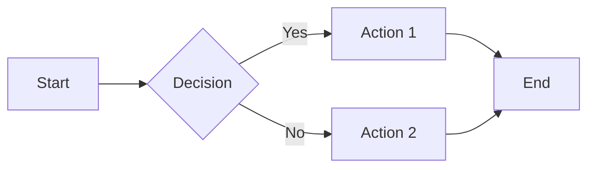
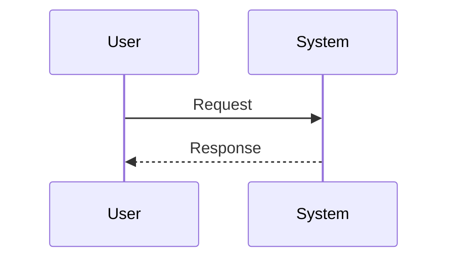

# User Guide

This guide covers how to write and organize your documentation effectively.

## Writing Documentation

### Markdown Basics

MkDocs uses Markdown for content. Here are the essentials:

#### Headers

```markdown
# H1 Header
## H2 Header
### H3 Header
#### H4 Header
```

#### Text Formatting

```markdown
**Bold text**
*Italic text*
***Bold and italic***
~~Strikethrough~~
`Inline code`
```

**Bold text**, *Italic text*, ***Bold and italic***, ~~Strikethrough~~, `Inline code`

#### Lists

Unordered list:

```markdown
- Item 1
- Item 2
  - Nested item
  - Another nested item
- Item 3
```

- Item 1
- Item 2
  - Nested item
  - Another nested item
- Item 3

Ordered list:

```markdown
1. First item
2. Second item
3. Third item
```

1. First item
2. Second item
3. Third item

#### Links and Images

```markdown
[Link text](https://example.com)

```

### Code Blocks

#### Basic Code Block

Use triple backticks with language identifier:

````markdown
```python
def hello():
    print("Hello, World!")
```
````

Result:

```python
def hello():
    print("Hello, World!")
```

#### Code with Line Numbers

```python linenums="1"
def calculate_sum(numbers):
    """Calculate the sum of a list of numbers."""
    total = 0
    for num in numbers:
        total += num
    return total

result = calculate_sum([1, 2, 3, 4, 5])
print(f"Sum: {result}")
```

#### Highlighted Lines

```python hl_lines="2 3"
def greet(name):
    message = f"Hello, {name}!"
    print(message)
    return message
```

### Admonitions

Admonitions are callout boxes for important information:

!!! note
    This is a note admonition. Use it for general information.

!!! abstract
    This is an abstract or summary.

!!! info
    This is an info admonition.

!!! tip
    This is a tip admonition. Share helpful hints here.

!!! success
    This indicates successful completion or positive outcomes.

!!! question
    Use this for questions or FAQs.

!!! warning
    This is a warning admonition. Use for cautionary information.

!!! failure
    This indicates failures or errors.

!!! danger
    This is for dangerous or critical information.

!!! bug
    Use this to document known bugs or issues.

!!! example
    This is for examples and demonstrations.

!!! quote
    Use this for quotations or citations.

#### Collapsible Admonitions

??? note "Click to expand"
    This admonition is collapsed by default. Click the title to expand it.

???+ tip "Expanded by default"
    This admonition is expanded by default but can be collapsed.

### Tabbed Content

Use tabs to organize related content:

=== "Python"

    ```python
    def hello():
        print("Hello from Python!")
    ```

=== "JavaScript"

    ```javascript
    function hello() {
        console.log("Hello from JavaScript!");
    }
    ```

=== "Java"

    ```java
    public void hello() {
        System.out.println("Hello from Java!");
    }
    ```

### Task Lists

Create interactive task lists:

- [x] Completed task
- [x] Another completed task
- [ ] Pending task
- [ ] Another pending task

### Tables

Create tables using Markdown:

| Feature | Description | Status |
|---------|-------------|--------|
| Search | Full-text search | ✅ |
| Dark Mode | Theme switching | ✅ |
| Mobile | Responsive design | ✅ |
| i18n | Internationalization | 🚧 |

### Footnotes

Add footnotes to your content[^1]:

```markdown
This is a sentence with a footnote[^1].

[^1]: This is the footnote content.
```

[^1]: This is the footnote content.

### Math Equations

Write mathematical equations using LaTeX syntax:

Inline equation: $E = mc^2$

Block equation:

$$
\frac{n!}{k!(n-k)!} = \binom{n}{k}
$$

### Mermaid Diagrams

Create diagrams using Mermaid:



Sequence diagram:



## Organizing Content

### File Structure

Organize your documentation logically:

```
docs/
├── index.md                 # Homepage
├── getting-started.md       # Getting started guide
├── user-guide.md           # This file
├── tutorials/              # Tutorial section
│   ├── tutorial-1.md
│   └── tutorial-2.md
├── reference/              # Reference documentation
│   ├── api.md
│   └── configuration.md
└── assets/                 # Images and files
    ├── images/
    └── downloads/
```

### Navigation Structure

Configure navigation in `mkdocs.yml`:

```yaml
nav:
  - Home: index.md
  - Getting Started: getting-started.md
  - User Guide: user-guide.md
  - Tutorials:
    - Tutorial 1: tutorials/tutorial-1.md
    - Tutorial 2: tutorials/tutorial-2.md
  - Reference:
    - API: reference/api.md
    - Configuration: reference/configuration.md
```

### Cross-References

Link to other pages:

```markdown
See the [Getting Started](getting-started.md) guide.
Link to a specific section: [Installation](getting-started.md#installation)
```

## Best Practices

### Writing Style

1. **Be Clear and Concise**: Use simple language
2. **Use Active Voice**: "Click the button" instead of "The button should be clicked"
3. **Be Consistent**: Use the same terminology throughout
4. **Add Examples**: Show, don't just tell
5. **Use Visual Aids**: Include diagrams, screenshots, and code examples

### Documentation Structure

1. **Start with Overview**: Explain what the feature/topic is
2. **Provide Context**: Why is it important?
3. **Show How**: Step-by-step instructions
4. **Include Examples**: Real-world use cases
5. **Troubleshooting**: Common issues and solutions

### Code Examples

1. **Keep Examples Simple**: Focus on one concept at a time
2. **Make Them Runnable**: Provide complete, working code
3. **Add Comments**: Explain complex parts
4. **Show Output**: Include expected results
5. **Handle Errors**: Show error handling when relevant

### Maintenance

1. **Review Regularly**: Keep documentation up to date
2. **Version Documentation**: Match docs to software versions
3. **Get Feedback**: Ask users what's unclear
4. **Fix Broken Links**: Check links periodically
5. **Update Screenshots**: Keep visuals current

## Advanced Features

### Custom CSS

Add custom styles in `docs/stylesheets/extra.css`:

```css
.custom-class {
    color: #ff6b6b;
    font-weight: bold;
}
```

Reference in `mkdocs.yml`:

```yaml
extra_css:
  - stylesheets/extra.css
```

### Custom JavaScript

Add custom scripts in `docs/javascripts/extra.js`:

```javascript
console.log("Custom script loaded");
```

Reference in `mkdocs.yml`:

```yaml
extra_javascript:
  - javascripts/extra.js
```

### Icons and Emojis

Use Material Design icons and emojis:

- :material-account-circle: Material icon
- :fontawesome-brands-github: Font Awesome icon
- :smile: Emoji
- :rocket: Another emoji

## Next Steps

- **[Reference](reference.md)** - Detailed configuration reference
- **[Material Documentation](https://squidfunk.github.io/mkdocs-material/reference/)** - Complete Material theme reference
- **[Markdown Guide](https://www.markdownguide.org/)** - Comprehensive Markdown guide